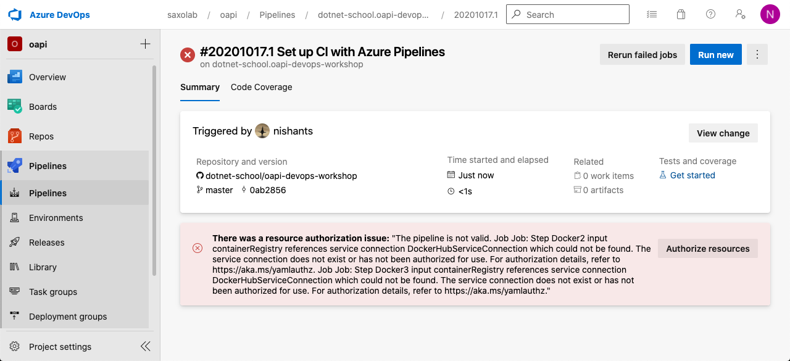

Todo 

- [x] Create pre-requisites

- [x] Create a web-api from boilerplate

- [x] Create a healtch check API : send version, remarks

- [x] Dockerize Web API

- [x] Crate kubernetes config

- [x] Run with Kind/Minikube locally 

- [x] Create AKS cluster

- [x] Deploy to AKS from Azure CLI

- [ ] Create a build pipeline

- [ ] Create a release pipeline 

  

### Setup

Make sure that following tools are available on your machine before starting.

- [ ] Powershell (if windows)
- [ ] Dotnet core (3.1 or 5-preview)
- [ ] Azure CLI - https://docs.microsoft.com/en-us/cli/azure/install-azure-cli 
- [ ] Azure account : http://portal.azure.com/
- [ ] Github account
  - [ ] Create a new repository for this project (completely empty)
- [ ] Docker
- [ ] Account on docker hub
- [ ] install kubectl: https://kubernetes.io/docs/tasks/tools/install-kubectl/
- [ ] Setup Minikube or  Kind : https://kind.sigs.k8s.io/docs/user/quick-start/ 


### Creating a Web API 

- Dotnet Core comes with some cool boiler-plate generator 

- Type `dotnet new -h` to view some of the boiler plates available: 
  e.g. : 
  
    <table>
  <tr><td> dotnet new cosnole</td><td>Console Application</td>        </tr>
  <tr><td> dotnet new webapi</td><td>Creat a Web API</td>       </tr>
  <tr><td>dotnet new react</td><td>Creates app with React.js</td> </tr>
  <tr><td>dotnet new grpc</td><td>Creates a gRPC Service  </td></tr>
</table>
  
- We will create a simple json service that will return data at a url :

  ```bash
  dotnet new webapi -o OAPI.Service
  ```

- Now run the app

  ```bash
  cd OAPI.Service
  dotnet run
  # info: Microsoft.Hosting.Lifetime[0]
  #       Now listening on: https://localhost:5001
  # info: Microsoft.Hosting.Lifetime[0]
  #       Now listening on: http://localhost:5000
  # info: Microsoft.Hosting.Lifetime[0]
  #       Application started. Press Ctrl+C to shut down.
  # info: Microsoft.Hosting.Lifetime[0]
  #       Hosting environment: Development
  # info: Microsoft.Hosting.Lifetime[0]
  #       Content root path: /Users/dawn/projects/dotnet-school/oapi-devops-workshop/OAPI.Service
  ```

- Open url https://localhost:5001/weatherforecast, you should get a response like :

  ```json
  [
    {
      "date": "2020-10-18T14:59:15.157908+05:30",
      "temperatureC": 10,
      "temperatureF": 49,
      "summary": "Warm"
    },
    {
      "date": "2020-10-19T14:59:15.158209+05:30",
      "temperatureC": -12,
      "temperatureF": 11,
      "summary": "Balmy"
    },
    {
      "date": "2020-10-20T14:59:15.158214+05:30",
      "temperatureC": -2,
      "temperatureF": 29,
      "summary": "Sweltering"
    },
    {
      "date": "2020-10-21T14:59:15.158214+05:30",
      "temperatureC": -6,
      "temperatureF": 22,
      "summary": "Cool"
    },
    {
      "date": "2020-10-22T14:59:15.158215+05:30",
      "temperatureC": 0,
      "temperatureF": 32,
      "summary": "Balmy"
    }
  ]
  ```
- Now lets generate a `.gitignore` before we can commit and push our project.

  ```bash
  cd ..
  dotnet new gitignore
  git add --all
  git commit -m "Create a web api"
  git remote add origin <your-repository-on-github>
  git push origin master
  ```


### Creating a health check API 

- Lets not think about why we need a health check API for now. Lets take this as a practice to add a new endpoint to our Web API.

- Create a file `OAPI.Service/Controllers/HealthCheckController.cs` : 

  ```c#
  using System.Collections.Generic;
  using Microsoft.AspNetCore.Mvc;
  
  namespace OAPI.Service.Controllers
  {
      [ApiController]
      [Route("")]
      public class HealthCheckController : ControllerBase
      {
         [HttpGet]
          public IDictionary<string, object> Get()
          {
              return new Dictionary<string, object>()
              {
                              ["version"] = "1.0", 
                              ["healthy"] = true, 
                              ["message"] = "Up and running", 
              };
          }
      }
  }
  ```

- Now run the project

  ```
  dotnet run
  ```

- In browser, open url: https://localhost:5001/

  ```json
  {
    "version": "1.0",
    "healthy": true,
    "message": "Up and running"
  }
  ```


### Dockerizing Web API

- Create a `.dockerignore` in project root. It works just like `.gitignore` for docker. It tells docker what files to ignore in our project.

  ```yaml
  # Directories
  **/bin/
  **/obj/
  **/out/
  
  # IDEs
  **/.idea
  **/.vscode
  
  # Files
  Dockerfile*
  README.md
  ```

- Create a `Dockerfile` in our project root and we will use it to compile our project

  ```dockerfile
  # Stage 1: Use an image with SDK (so that we can compile and build app)
  FROM mcr.microsoft.com/dotnet/core/sdk:3.1 AS build
  WORKDIR /source
  
  # Run dotnet restore
  COPY OAPI.Service/*.csproj .
  RUN dotnet restore
  
  # Copy rest of project and publish app int /app directory
  COPY ./OAPI.Service .
  RUN dotnet publish -c release -o /app --no-restore
  ```

- Now lets build and check our docker configuration to compile project

  ```bash
  docker build -t oapi-service .
  
  # Sending build context to Docker daemon  188.4kB
  # Step 1/6 : FROM mcr.microsoft.com/dotnet/core/sdk:3.1 AS build
  #  ---> c4155a9104a8
  # Step 2/6 : WORKDIR /source
  #  ---> Using cache
  #  ---> e3c14feb38e6
  # Step 3/6 : COPY OAPI.Service/*.csproj .
  #  ---> Using cache
  #  ---> a0c5001dbcd5
  # Step 4/6 : RUN dotnet restore
  #  ---> Using cache
  #  ---> df30f3657cbc
  # Step 5/6 : COPY ./OAPI.Service .
  #  ---> Using cache
  #  ---> 86d437cabddd
  # Step 6/6 : RUN dotnet publish -c release -o /app --no-restore
  #  ---> Using cache
  #  ---> 2b0e6f7d8866
  # Successfully built 2b0e6f7d8866
  # Successfully tagged oapi-service:latest
  ```

- Right now our docker image only compiles the project using .net sdk.

- Now, lets make the docker image runt the app. Add following to end of `Dockerfile` : 

  ```dockerfile
  # Stage 2: We do not need the sdk at runtime (smaller efficient image)
  FROM mcr.microsoft.com/dotnet/core/aspnet:3.1
  WORKDIR /app
  
  # Copy files form previous stage 
  COPY --from=build /app .
  
  EXPOSE 80
  ENTRYPOINT ["dotnet", "OAPI.Service.dll"]
  ```

- Lets build and run the docker image now : 

  ```bash
  docker build -t oapi-service .
  
  # Run our docker image as a container
  # Map our machines port 5001 to container's port 80
  docker run -p 5001:80 oapi-service
  ```

- Now open url http://localhost:5001/, it should return our health check as expected : 

  ```json
  {
    "version": "1.0",
    "healthy": true,
    "message": "Up and running"
  }
  ```

- Lets push our app to dockerhub now : 

  ```bash
  # replace "nishants" with your own user name
  docker tag oapi-service nishants/oapi-service:v1.0 
  
  docker login
  docker push nishants/oapi-service:v1.0 
  ```

- Now go to dockerhub and make sure the image is public. 

- Now lets see if we understand docker, lets try to answer :

  - Why did we copy `.csproj` file before restoring project and then copied the rest of files ?

    ```dockerfile
    # Stage 1: Use an image with SDK (so that we can compile and build app)
    FROM mcr.microsoft.com/dotnet/core/sdk:3.1 AS build
    WORKDIR /source
    
    # Run dotnet restore
    COPY OAPI.Service/*.csproj .
    RUN dotnet restore
    
    # Copy rest of project and publish app int /app directory
    COPY ./OAPI.Service .
    RUN dotnet publish -c release -o /app --no-restore
    
    #....
    ```

    > Learn about layers in Docker images

  - Why did we use two different images in the same `Dockerfile` ? 

    ```dockerfile
    # Stage 1: Use an image with SDK (so that we can compile and build app)
    FROM mcr.microsoft.com/dotnet/core/sdk:3.1 AS build
    WORKDIR /source
    
    # ...
    
    # Stage 2: We do not need the sdk at runtime (smaller efficient image)
    FROM mcr.microsoft.com/dotnet/core/aspnet:3.1
    WORKDIR /app
    
    # ...
    ```

    > Learn about multistage docker builds


### Crating Kubernetes config

- **How K8s works ?**

  - It uses declarative style (in `yaml` files )
  - i.e. **we tell what is the desired state for a cluster using YAML declaration**
  - and run the `kubectl apply`
  - Kubernetes automactically makes changes to the cluster based on our desired state.

  >  Every release is basically a new configuration, using new docker images

- **Our desired state of cluster would be**

  - Running severale instances of app as a docker container
  - Load balancer to receive traffic from internet (from outside the cluster)

- **In Kubernetes language what we need is**

  | What we need ?                                               | In Kuberntes language                          |
  | ------------------------------------------------------------ | ---------------------------------------------- |
  | Running severale instances of app as a docker container      | **Deployment** resource for app's docker image |
  | Load balancer to receive traffic from internet (outside the cluster) | **Service** of type load balancer              |

- Create a file `k8/oapi-deployment.yml`  in project as :

  ```yml
  # This part creates a pod that runs our docker image
  apiVersion: apps/v1
  kind: Deployment
  metadata:
    name: oapi-app-deployment
  spec:
    replicas: 2    # Alwasy run two isntances of app
    selector:
      matchLabels:
        app: oapi-app
    template:
      metadata:
        labels:
          app: oapi-app
      spec:
        containers:
          - name: oapi-app
            image: nishants/oapi-service:v1.0 # Dockerhub image
            ports:
              - containerPort: 80         # Port that our app listens to
            imagePullPolicy: Always       # To keep simple for now
  ```

- Create another file `k8/oapi-service.yml`  in project as :

  ```yml
  # This part creates a load balancer pod that receives traffic from
  # internet and load-balances to our pods
  apiVersion: v1
  kind: Service
  metadata:
    name: oapi-service
  spec:
    selector:
      app: oapi-app     # This makes load balancer point to oapi-app
    ports:
      - port: 80        
        targetPort: 80  # The port our container(in pods) listens to
    type: LoadBalancer
  ```

  

- Test k8s configuration locally using [Kind](https://kind.sigs.k8s.io/docs/user/quick-start/): 

  ```bash
  kind create cluster --name oapi-cluster
  # Creating cluster "oapi-cluster" ...
  #  ✓ Ensuring node image (kindest/node:v1.19.1) 🖼
  #  ✓ Preparing nodes 📦
  #  ✓ Writing configuration 📜
  #  ✓ Starting control-plane 🕹️
  #  ✓ Installing CNI 🔌
  #  ✓ Installing StorageClass 💾
  
  kubectl apply -f k8
  # deployment.apps/oapi-app-deployment created
  # service/oapi-service created
  
  
  ```
  
  With Kind, it is not possible (or I don't understand) how to access the load balancer on local machine. Though it is straight forward with minikube as shown in next step.

- With minikube

  ```bash
  minikube start --vm-driver=virtualbox # Start with VirtualBox 
  kubectl apply -f k8
  minikube service oapi-service
  ```

  

### Creating cluster on Azure Kubernetes Service

- Login with Azure CLI

  ```bash
  azure login
  ```

  This will open a window in browser for authentication.

- Ceate azure resources from command line : 

  ```bash
  
  RESOURCE_GROUP=oapi-service-resource
  CLUSTER_NAME=oapi-service
  REGION=westeurope
  
  # Create resource
  az group create --name $RESOURCE_GROUP --location $REGION
  
  # Create cluster on AKS with 1 node
  az aks create --resource-group $RESOURCE_GROUP \
  --name $CLUSTER_NAME \
  --node-count 1 \
  --enable-addons monitoring \
  --generate-ssh-keys
  
  # Allow kubectl to connect and manage our AKS clustuer
  az aks get-credentials \
  --resource-group $RESOURCE_GROUP \
  --name $CLUSTER_NAME
  
  kubectl get nodes
  # NAME                                STATUS   ROLES   AGE     VERSION
  # aks-nodepool1-36600731-vmss000000   Ready    agent   2m58s   v1.16.10
  
  # deploy our app on AKS
  
  kubectl apply -f k8
  # deployment.apps/oapi-app-deployment created
  # service/oapi-service created
  ```

- Get the public address of our load balancer created on Azure

  ```bash
  kubectl get service/oapi-service
  # NAME           TYPE           CLUSTER-IP     EXTERNAL-IP    PORT(S)        
  # oapi-service   LoadBalancer   10.0.237.105   20.54.227.54   80:30694/TCP   
  ```

- Now access the EXTERNAL-IP as http : http://external_ip_of_service


### Creating build pipeline

- Go to https://dev.azure.com

- Create new project `oapi`

  

- Open new project and go to pipelines 

  


- Click on create pipeline 

  

  

- Select source as GitHub and then choose you project

- You can choose from many availble boilerplate builds, but we will choose the Starter Pipeline for this project

  

- We will simply create and build a docker image in out build steps. In a real project, it would involve running dotnet build and tests before we publish the docker image

  ```yaml
  trigger:
  - master
  
  pool:
    vmImage: 'ubuntu-latest'
  
  variables:
    dockerRepository: "nishants/oapi-service"
    tag: "v1.0.$(Build.BuildId)"
    imageName: "nishants/oapi-service:v1.0.$(Build.BuildId)"
    buildConfiguration: 'Release'
  
  steps:
  - task: Docker@2
    displayName: Build Image
    inputs:
      command: build
      dockerfile: '**/Dockerfile'
      repository: $(dockerRepository)          
      tags: $(tag)          
  
  - task: Docker@2
    displayName: Login to Docker Hub
    inputs:
      command: login
      containerRegistry: DockerHubServiceConnection
  
  - task: Docker@2
    displayName: Publish Image
    inputs:
      command: push
      containerRegistry: DockerHubServiceConnection
      repository: $(dockerRepository)          
      tags: $(tag)  
  ```

  

  


- Click on save and run

  


- You should see an error message :

  


- Lets fix this by creating a service connection. Go to project settings (menu item on bottom left of page)

- Then choose the service connections : 

  

- Search for docker registry in connection type option: 

  


- Choose Docker Hub in registry type, enter you user and password for docker hub and click on verify 

  


- Enter service connection name as `DockerHubServiceConnection`

  


- Now go back to our pipeline and run it for master branch
- After the pipeline runs successfully, go to docker hub and check if the image was correctly created.


### Delete the cluster

 ```bash
az group delete --name $RESOURCE_GROUP --yes --no-wait
 ```

  

